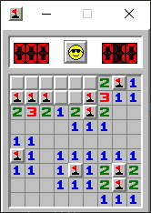

# Python Minesweeper
Recreation of the classic Minesweeper game using Pygame.

The game is in beginner mode, which is a 9x9 playing field. Question marks are not used.

Game started on ‎Tuesday, ‎July ‎16, ‎2019, ‏‎3:28:13 PM, finished on Friday, Febuary 14, 2020, 9:38:00 PM

>*Set up Pygame to run the code:* [Add Pygame](https://stackoverflow.com/questions/28453854/add-pygame-module-in-pycharm-id)
